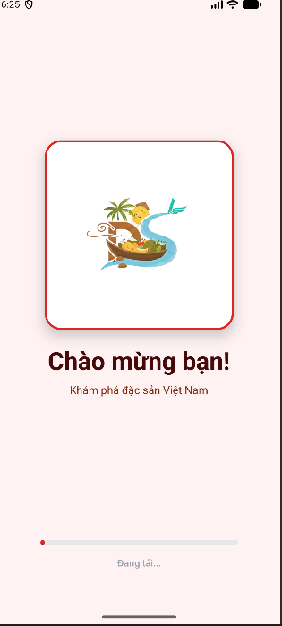
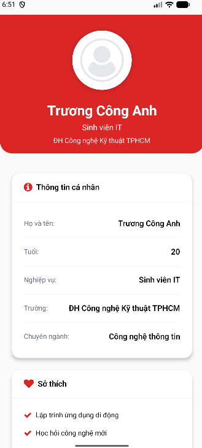
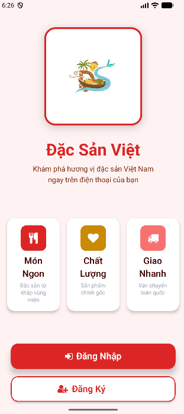
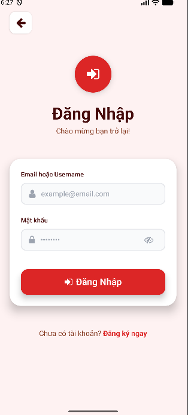
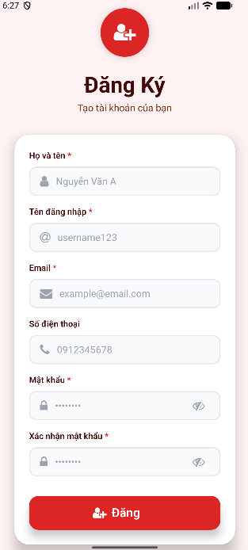

# Đặc Sản Việt Mobile App


Ứng dụng React Native (TypeScript + Expo) cho đăng nhập/đăng ký không OTP/JWT, giao diện vibrant theo phong cách ẩm thực Việt.

## Tính năng chính

- Intro 10s, Welcome landing, Login (email/username), Register 6 trường
- Validation realtime, toggle password, loading state
- Homepage hiển thị hồ sơ, logout
- Mock UI cho luồng OTP/Forgot/Reset để tham khảo
## Yêu cầu
- Node.js 16+, npm/yarn
- Expo CLI
- Emulator iOS/Android hoặc thiết bị thật

## Cài đặt & cấu hình API

```bash
npm install
```

Chỉnh `API_BASE_URL` trong `services/api.ts` về IP máy bạn (ví dụ: `http://YOUR_IP:3001/api`).

## Chạy ứng dụng

```bash
npm start
npm run ios
npm run android
npm run web
```
## Luồng điều hướng

```
Intro → Welcome → Login/Register → Homepage
Forgot password: Login → Quên mật khẩu → Nhập email → Nhập OTP → Reset password
```

## Demo giao diện

<table>
  <tr>
    <td align="center">
      <br/>
      <em>Màn hình loading</em>
    </td>
    <td align="center">
      <br/>
      <em>Màn hình giới thiệu cá nhân</em>
    </td>
  </tr>
  <tr>
    <td align="center">
      <br/>
      <em>Màn hình Welcome</em>
    </td>
    <td align="center">
      <br/>
      <em>Giao diện trang đăng nhập đơn giản</em>
    </td>
    <td align="center">
      <br/>
      <em>Giao diện trang đăng ký đơn giản</em>
    </td>
  </tr>
    <tr>
    <td align="center">
      
      <br />
      <em>Giao diện quên mật khẩu</em>
    </td>
    <td align="center">
      
      <br />
      <em>Giao diện trang nhập mã OTP</em>
    </td>
    <td align="center">
      
      <br />
      <em>Giao diện Email gửi mã xác thực khi quên mật khẩu</em>
    </td>
  </tr>
  <tr>
    <td align="center">
      
      <br />
      <em>Giao diện nhập mã OTP khi đăng kí</em>
    </td>
<td align="center">
      
      <br />
      <em>Giao diện Email gửi mã xác thực đăng kí</em>
    </td>
<td align="center">
      
      <br />
      <em>Giao diện Email khi đăng kí thành công</em>
    </td>
  </tr>
</table>

## Cấu trúc dự án

```
BaiTapTuan1_TypeScript/
├── components/                      # Reusable components
│   ├── OTPInput.tsx                # Custom OTP input component
│   ├── Button.tsx                  # Custom button component
│   ├── TextInput.tsx               # Custom text input component
│   └── LoadingSpinner.tsx          # Loading indicator
│
├── constants/                       # App constants
│   └── theme.ts                    # Colors, fonts, sizes, spacing
│
├── screens/                         # App screens
│   ├── IntroScreen.tsx             # Loading screen (10s)
│   ├── WelcomeScreen.tsx           # Landing page with CTA buttons
│   ├── LoginScreen.tsx             # Email/Username login form
│   ├── RegisterScreen.tsx          # Registration form (6 fields)
│   ├── ForgotPasswordScreen.tsx    # Forgot password - email input
│   ├── OTPVerificationScreen.tsx   # OTP verification screen
│   ├── ResetPasswordScreen.tsx     # New password input & confirm
│   └── HomepageScreen.tsx          # User dashboard
│
├── services/                        # API services
│   └── api.ts                      # API client & HTTP methods
│
├── types/                           # TypeScript types
│   ├── api.ts                      # API request/response types
│   ├── navigation.ts               # Navigation stack types
│   └── profile.ts                  # User profile types
│
├── assets/                          # Static resources
│   ├── dacsanvietLogo.webp        # Brand logo
│   ├── icon.png                    # App icon
│   ├── splash-icon.png             # Splash screen
│   └── adaptive-icon.png           # Android adaptive icon
│
├── screenshots/                     # App screenshots for demo
│   ├── loadingScreen.png
│   ├── welcome.png
│   ├── loginScreen.png
│   ├── registerScreen.png
│   ├── registerotp.jpg
│   ├── inputotpregister.png
│   ├── forgotpass.png
│   ├── otpforgotpass.png
│   ├── resetpass.jpg
│   └── mailinfo.jpg
│
├── App.tsx                          # Main app component & navigation
├── index.ts                         # Entry point
├── app.json                         # Expo configuration
├── tsconfig.json                    # TypeScript configuration
├── package.json                     # Dependencies & scripts
└── README.md                        # Documentation
```

## API Integration

### Backend Server
- **Framework**: Node.js + Express
- **Database**: MySQL
- **Authentication**: JWT + OTP
- **Email Service**: Nodemailer với Gmail

### API Endpoints
```
POST   /api/auth/register                  # Đăng ký (legacy)
POST   /api/auth/send-registration-otp    # Gửi OTP đăng ký
POST   /api/auth/verify-registration-otp  # Xác thực OTP đăng ký
POST   /api/auth/login                    # Đăng nhập
POST   /api/auth/send-password-reset-otp  # Gửi OTP reset password
POST   /api/auth/reset-password-otp       # Reset password với OTP
POST   /api/auth/logout                   # Đăng xuất
GET    /api/health                        # Health check
```

### Environment Variables
```
# Server
PORT=3001
NODE_ENV=development

# Database
DB_HOST=localhost
DB_PORT=3306
DB_USER=root
DB_PASSWORD=your_password
DB_NAME=DacSanViet

# JWT
JWT_SECRET=your-secret-key
JWT_EXPIRES_IN=24h

# Email (Gmail)
EMAIL_HOST=smtp.gmail.com
EMAIL_PORT=587
EMAIL_USER=your-email@gmail.com
EMAIL_PASS=your-app-password
```

## User Flow

### Đăng ký tài khoản
1. Nhập thông tin cá nhân
2. Gửi OTP đến email
3. Nhập mã OTP 6 số
4. Xác thực thành công → Tự động đăng nhập

### Đăng nhập
1. Nhập email/username và mật khẩu
2. Xác thực thành công → Lưu JWT tokens
3. Chuyển đến trang chủ

### Quên mật khẩu
1. Nhập email
2. Gửi OTP đến email
3. Nhập mã OTP 6 số
4. Nhập mật khẩu mới
5. Xác nhận mật khẩu → Cập nhật thành công

## Test Accounts
### Admin Account
- Email: admin@dacsanviet.com
- Password: admin123
